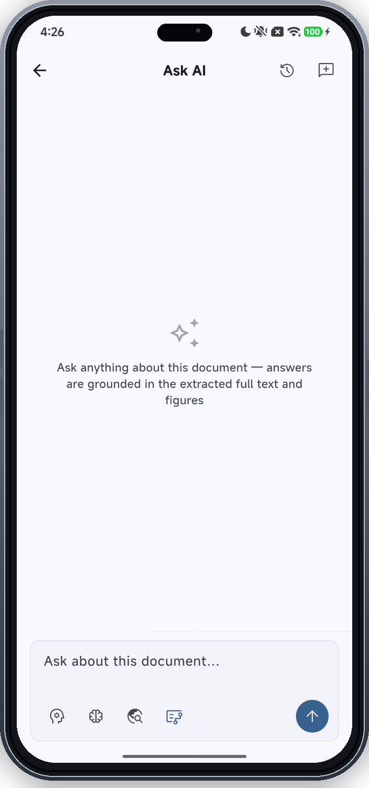
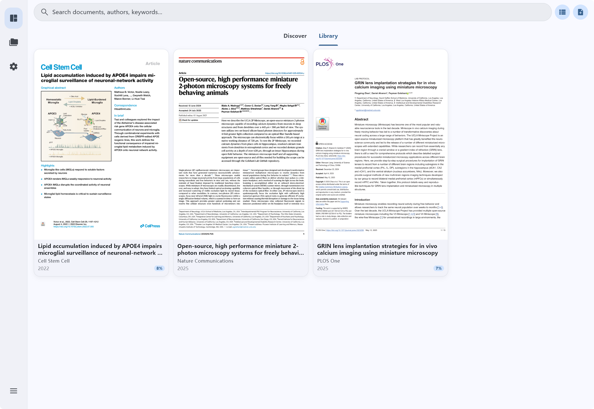

# OtterPad

**Academic Literature Reader & Manager for Mobile & Desktop**

English | [简体中文](docs/README_zh.md)

## Why OtterPad?

Reading PDF papers on a phone is a miserable experience — cramped layout, tiny text, constant zooming and panning. Some reading apps can reflow imported PDFs into HTML for easier reading (WeChat Reading, Apple Books, Kindle), but the reflow often breaks the page structure and drops figures and tables, making things worse instead of better. With what AI can do today, reading academic papers on mobile should be comfortable and interactive.

OtterPad uses PaddleOCR-VL under the hood to power a figure extraction and layout reflow engine that adapts PDF content for small screens while keeping figures, tables, and formulas intact. Full-text translation and AI Q&A round it out, so you can actually get through a paper on your phone.

## Screenshots

### Mobile

The same paper reflowed for a phone, with figure extraction and full-text Q&amp;A.

<table>
  <tr>
    <td align="center" width="50%">
      <b>PDF Reader</b> 
      
    </td>
    <td align="center" width="50%">
      <b>Bilingual Reflow</b> 
      
    </td>
  </tr>
  <tr>
    <td align="center" width="50%">
      <b>Figure Extraction</b> 
      
    </td>
    <td align="center" width="50%">
      <b>Full-Text Q&amp;A</b> 
      
    </td>
  </tr>
</table>

### Desktop

Read the original and the translation side by side, with figures docked beside the page.

<table>
  <tr>
    <td colspan="2" align="center">
      <b>Library</b> 
      
    </td>
  </tr>
  <tr>
    <td align="center" width="50%">
      <b>Bilingual PDF Reading</b> 
      
    </td>
    <td align="center" width="50%">
      <b>Reflow Reading &amp; Figure Sidebar</b> 
      
    </td>
  </tr>
</table>

## What It Does

### Reading & Reflow

- PDF layout reflow optimized for mobile screens, preserving figures, tables, and formulas
- Customizable themes, font sizing, with highlighting and annotation support

### Figure Extraction

- Automatic figure and table detection and extraction powered by PaddleOCR-VL
- Standalone viewing, copying, and sharing of extracted figures

### Translation & Q&A

- Document-level paragraph translation with automatic protection of formulas, code blocks, and citation markers
- Full-text Q&A grounded in the extracted text and figures, reducing hallucination
- Supports OpenAI, Anthropic, Google, and compatible API providers

### Paper Management

- Multi-source search and metadata resolution via DOI, PubMed, Crossref, Semantic Scholar, etc.
- AI-powered file renaming, custom categories and tags, two-way Zotero sync
- Cloud backup and restore (S3 / WebDAV) with configurable auto-backup

## Installation

Download the package for your platform from [Releases](https://github.com/Cyli00/OtterPad/releases):

**Android**

- `arm64-v8a` — Most modern Android devices
- `armeabi-v7a` — Older 32-bit devices

**Windows** — x64 installer (`-setup.exe`) or portable zip

**macOS** — Apple silicon DMG. This build is unsigned; allow it in System Settings → Privacy & Security on first launch.

Linux desktop is not supported yet.

## Development

This project was built with the help of [Claude Code](https://claude.com/claude-code), using Flutter 3.44.6 + Dart 3.12.2.

| Layer | Stack |
| :--- | :--- |
| Framework | Flutter 3.44.6 + Dart 3.12.2 |
| State Management | Riverpod |
| Routing | GoRouter |
| Local Storage | SQLite / Drift + Flutter Secure Storage (credentials) |
| Networking | Dio + HTTP/2 |
| OCR / Layout Analysis | PaddleOCR-VL |
| Design | Material Design 3 |

## Acknowledgements

These projects and communities provided valuable reference and support:

- [PiliPlus](https://github.com/bggRGjQaUbCoE/PiliPlus) — Third-party BiliBili client built with Flutter
- [PDFMathTranslate](https://github.com/PDFMathTranslate/PDFMathTranslate) — AI-powered PDF translation preserving full layout (EMNLP 2025)
- [FlClash](https://github.com/chen08209/FlClash) — Multi-platform proxy client based on ClashMeta
- [Kelivo](https://github.com/Chevey339/kelivo) — Multi-platform LLM chat client built with Flutter
- [LINUX DO](https://linux.do/) — A sincere, friendly, and professional tech community for invaluable feedback and support

## License

Licensed under [GPL-3.0](./LICENSE).
