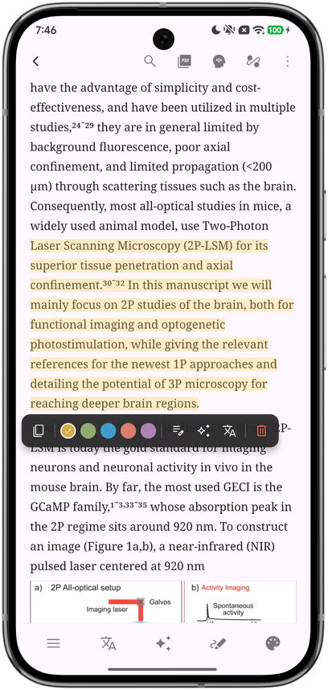
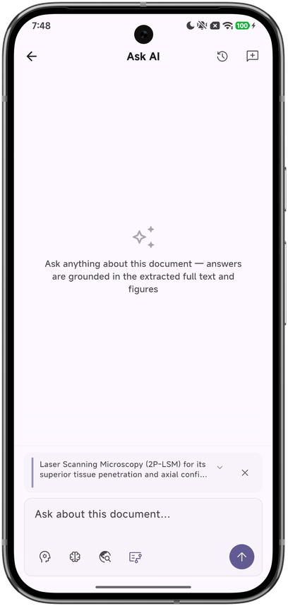

# OtterPad

**AI-Powered Cross-Platform Academic Paper Reader**

English | [简体中文](docs/README_zh.md)

## What is this?

OtterPad is a cross-platform academic literature reading and management tool with integrated AI workflows, helping researchers efficiently read, understand, and manage papers.

- 📖 Immersive PDF reading with customizable themes and typography
- 🤖 AI-powered full-text Q&A grounded in extracted text and figures
- 🌐 Document-level paragraph translation preserving formulas and code blocks
- 🔍 Multi-source literature search and metadata resolution
- 📊 Intelligent figure/table extraction and standalone viewing

| Immersive Reading | AI Full-Text Q&A |
|:---:|:---:|
|  |  |

## Features

### Reading & Translation
- **Immersive Reading** — Customizable theme colors, font sizes, highlighting and annotations
- **Paragraph-Level Translation** — 8 concurrent workers translating paragraph by paragraph, automatically protecting formulas / code / citation numbers
- **Figure Extraction** — Accurately identifies figures and tables in PDFs for standalone viewing and copying

### AI Understanding
- **Full-Text Q&A** — AI answers any question about the document, grounded in extracted full text and figures
- **Multi-Model Support** — OpenAI / Anthropic / Google / compatible APIs, switch freely
- **Smart Summary** — AI-generated key takeaways from papers

### Literature Management
- **Multi-Source Search** — Search via DOI / PubMed / Crossref / Semantic Scholar and more
- **AI Rename** — Intelligent file naming based on metadata
- **Collections & Tags** — Custom categorization and tagging system
- **Zotero Sync** — Two-way sync with your Zotero library

### Data Safety
- **Cloud Backup** — S3 / WebDAV cloud backup and restore
- **Auto Backup** — Configurable scheduled automatic backups

## Installation

Download the APK for your architecture from [Releases](https://github.com/Cyli00/NightReader/releases):
- `arm64-v8a` — Most modern Android devices
- `armeabi-v7a` — Older 32-bit devices
- `x86_64` — Emulators / ChromeOS

> Desktop and iOS builds are planned but not yet available.

## Tech Stack

- **Framework** — Flutter 3.x + Dart 3.x
- **State Management** — Riverpod
- **Routing** — GoRouter
- **Storage** — Hive (local) + Flutter Secure Storage (credentials)
- **Networking** — Dio + HTTP/2
- **Design Language** — Material Design 3

## Acknowledgements

OtterPad stands on the shoulders of these excellent open-source projects:

- [PiliPlus](https://github.com/bggRGjQaUbCoE/PiliPlus) — Third-party BiliBili client built with Flutter
- [PDFMathTranslate](https://github.com/PDFMathTranslate/PDFMathTranslate) — AI-powered PDF translation preserving full layout (EMNLP 2025)
- [FlClash](https://github.com/chen08209/FlClash) — Multi-platform proxy client based on ClashMeta
- [Kelivo](https://github.com/Chevey339/kelivo) — Multi-platform LLM chat client built with Flutter

## License

This project is licensed under [GPL-3.0](./LICENSE).
