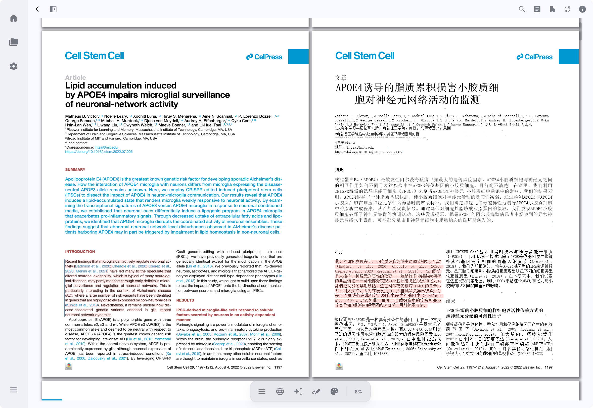
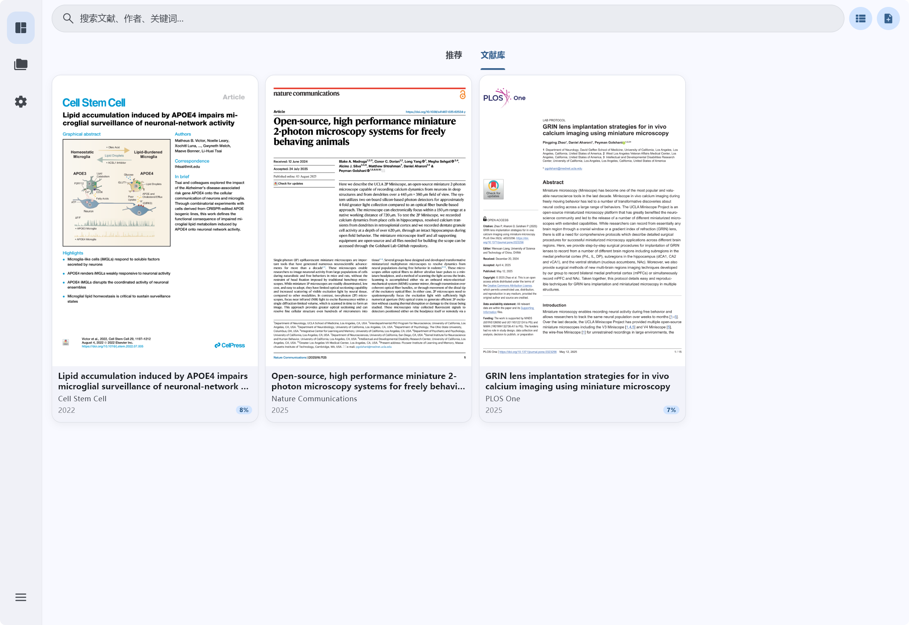
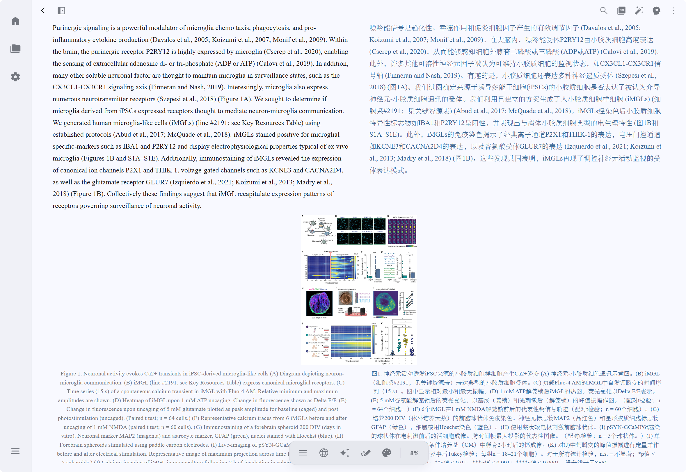
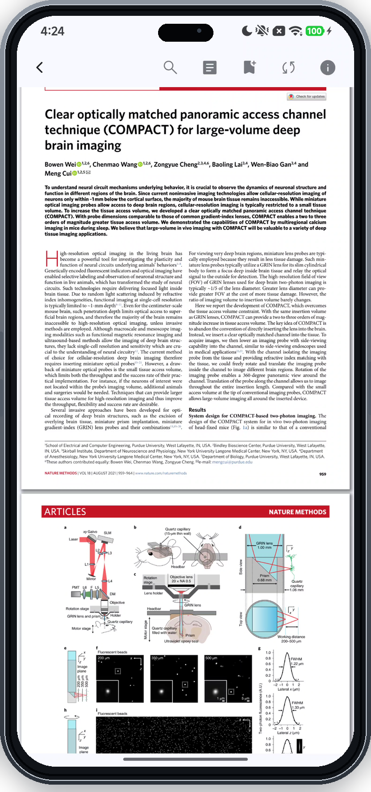
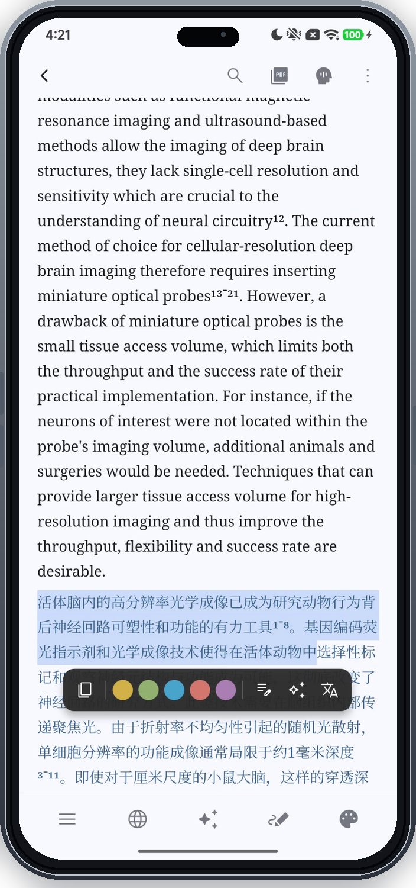
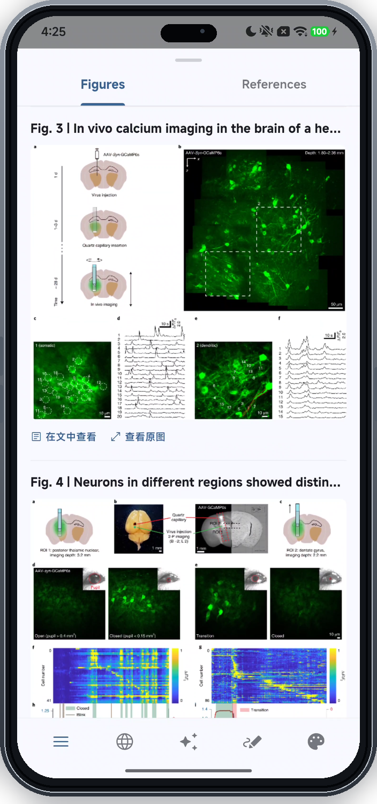
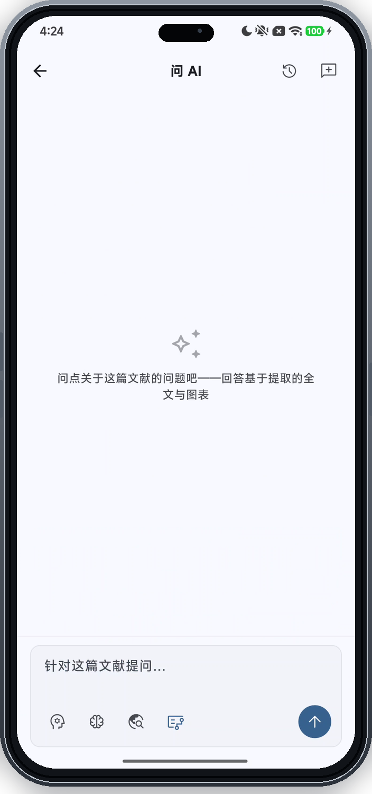

# 獭祭鱼 OtterPad

**移动端与桌面端学术文献阅读与管理工具**

[English](../README.md) | 简体中文

## 项目背景

在手机上读 PDF 论文是个很折磨的过程——排版挤、字号小、来回缩放。市面上一些阅读软件虽然能把导入的 PDF 文件重排为 html 格式阅读（如微信读书、Apple Books、Kindle），但重排之后版面乱、图表丢，读着反而更费劲。AI 发展到今天，应该让学术文献在移动端也能舒服地读、方便地交互。

OtterPad 在 PaddleOCR-VL 的基础上做了一套图表提取与版面重排引擎，把 PDF 转成适合小屏阅读的排版，同时保留图表和公式。再加上全文翻译和 AI 问答，让读论文这件事在手机上不再痛苦。

## 界面预览

### 桌面端

同页原文与译文左右对照，图表侧栏随时查阅。

<table>
  <tr>
    <td colspan="2" align="center">
      <b>PDF 双排对照</b> 
      
    </td>
  </tr>
  <tr>
    <td align="center" width="50%">
      <b>文献库</b> 
      
    </td>
    <td align="center" width="50%">
      <b>重排阅读与图表侧栏</b> 
      
    </td>
  </tr>
</table>

### 移动端

同一篇文献在小屏上的重排阅读、图表提取与全文问答。

<table>
  <tr>
    <td align="center" width="50%">
      <b>PDF 阅读</b> 
      
    </td>
    <td align="center" width="50%">
      <b>双语重排</b> 
      
    </td>
  </tr>
  <tr>
    <td align="center" width="50%">
      <b>图表提取</b> 
      
    </td>
    <td align="center" width="50%">
      <b>全文问答</b> 
      
    </td>
  </tr>
</table>

## 主要功能

### 阅读与重排

- PDF 版面重排，适配移动端小屏阅读，保留图表和公式
- 自定义主题配色、字号排版，支持高亮与批注

### 图表提取

- 基于 PaddleOCR-VL 自动识别和提取 PDF 中的图表
- 图表独立查看、复制、分享

### 翻译与问答

- 文档级段落翻译，自动保护公式、代码块和引用编号
- 全文 AI 问答，基于提取后的完整文本和图表回答，降低幻觉
- 支持 OpenAI / Anthropic / Google 等多种模型

### 文献管理

- DOI / PubMed / Crossref / Semantic Scholar 等多源检索与元数据解析
- AI 自动命名、分类标签、Zotero 双向同步
- 云备份与恢复（S3 / WebDAV），支持定时自动备份

## 安装

从 [Releases](https://github.com/Cyli00/OtterPad/releases) 下载对应平台的安装包：

**Android**

- `arm64-v8a` — 大多数现代 Android 设备
- `armeabi-v7a` — 较旧的 32 位设备

**Windows** — x64 安装器（`-setup.exe`）或免安装便携版

**macOS** — Apple 芯片 DMG。该包未做签名与公证，首次打开需在「系统设置 → 隐私与安全性」中放行。

Linux 桌面端暂不支持。

## 开发

本项目使用 [Claude Code](https://claude.com/claude-code) 辅助开发，基于 Flutter 3.44.6 + Dart 3.12.2。

| 层面 | 选型 |
| :--- | :--- |
| 框架 | Flutter 3.44.6 + Dart 3.12.2 |
| 状态管理 | Riverpod |
| 路由 | GoRouter |
| 本地存储 | SQLite / Drift + Flutter Secure Storage（凭据） |
| 网络 | Dio + HTTP/2 |
| OCR / 版面分析 | PaddleOCR-VL |
| 设计 | Material Design 3 |

## 致谢

以下项目和社区为本项目提供了重要参考和支持：

- [PiliPlus](https://github.com/bggRGjQaUbCoE/PiliPlus) — 基于 Flutter 的第三方 BiliBili 客户端
- [PDFMathTranslate](https://github.com/PDFMathTranslate/PDFMathTranslate) — AI 驱动的 PDF 翻译，完整保留排版（EMNLP 2025）
- [FlClash](https://github.com/chen08209/FlClash) — 基于 ClashMeta 的多平台代理客户端
- [Kelivo](https://github.com/Chevey339/kelivo) — 基于 Flutter 的多平台 LLM 聊天客户端
- [LINUX DO](https://linux.do/) — 真诚、友善、团结、专业的技术社区，感谢宝贵的反馈与支持

## 开源协议

本项目基于 [GNU General Public License v3.0](../LICENSE) 开源。
